# Getting Started

In this section, we'll walk through the process of setting up the MegaGrid plugin. While the setup might seem detailed, this is intentional—each element is designed to be as simple and modular as possible, allowing for easy customization and replacement. This comes at the cost of extra work.

!!! note 
    If you're using one of our example projects, the steps below are not necessary as they've been already prepared.

## 1. Project Settings

1. To get started, go to ``Edit → Project Settings → Rendering``
 and set **Custom Depth-Stencil Pass** to **Enabled With Stencil**.
This is required for Zero Aliasing Grid and tile materials to work properly.

    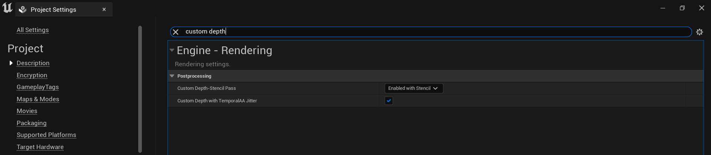

2. Next search for "Trace Channel" and add two new channels in this order:
    - **AutoMap** - Set to ``Ignore``.
    - **GridSurface** - Set to ``Ignore``.
    
    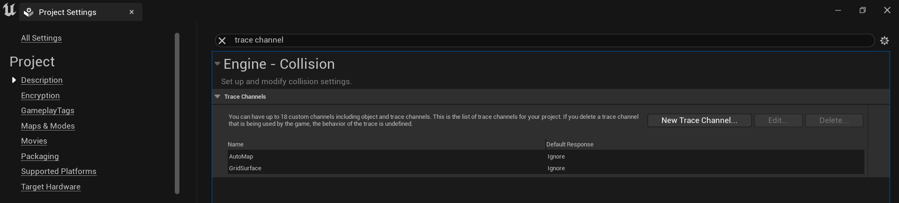

    The exact names and order of creation aren't critical, as you'll set these new channels manually in the GridManager blueprint later. However, for the sake of simplicity, I’ve made these recommendations. That said, it is crucial to set the ``Default Response`` of these channels to ``Ignore``. 

3. Mega Grid plugin has elements that use ``SceneTexture`` and other nodes from GBuffer for its materials. This requires that the project runs in
Deferred Shading. So make sure Forward Shading is disabled. Search for "Shading" and uncheck the ``Forward Shading`` box.

    

!!! note 
    In the example project, there's an additional ``Unit`` channel. While it's used for agent selection in the example, it's not essential for the basic grid functionality.

## 2. Surface Preparation {#level-grid-creation}

Next, we need a Grid Surface, which is any mesh that will serve as the surface for our grid. For this tutorial, I'll use the default landscape from a new project, but you can also work with custom heightmaps and meshes. We'll cover creating custom grid shapes later. Once you've chosen a surface, follow these steps:

1. Select your surface. If you're using landscape proxies, select all proxies.

    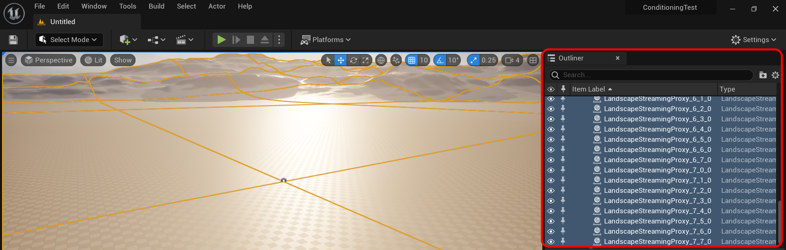

2. Go to the details panel, search for "Custom Depth" and enable ``Render CustomDepth Pass`` and set the ``Stencil Value`` to **77**. If your project already uses this specific value, it can be changed in the material instances of Zero Aliasing Grid.

    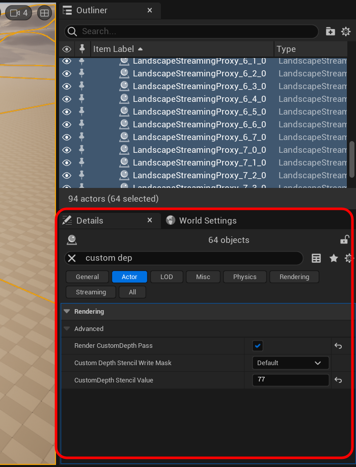{: style="height:500px;width:400px"}

3. Next while keeping your surface selected, search for "Collision". Change the ``Collision Presets`` to ``Custom``, and under ``Collision Responses``, set your newly created **GridSurface** channel to ``Block   ``.

    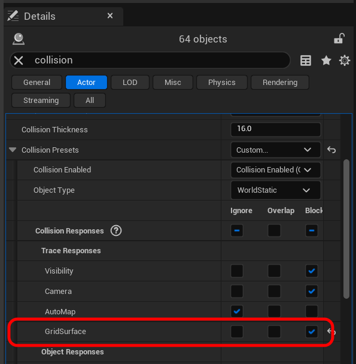{: style="height:400px;width:400px"}

4. Lastly you'll need to add an actor tag to the surface with the string *"GridSurface"*. This will be required later for tile generation.

    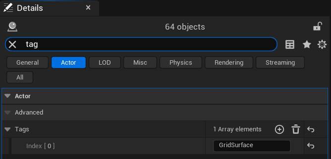

    !!! Tags
        "Why tags when you have a trace channel?" You might ask. Well this has to do with modularity and the versatility of the plugin.
        Imagine you want to block a certain area from generating tiles, you can use a "blocking" mesh with the same collision response but this time without the tag, this will ensure you skip that area.

## 3. SaveHandler {#assign-save-name}

!!! warning
    This actor is mandatory for the grid to function.

With the surface now prepared, it's time to add the SaveHandler to the scene. The ``BP_SaveHandler`` actor manages .sav files, allowing each level to have its own unique save file and grid system. Neither the ``BP_SaveHandler`` nor its parent class store any data directly; instead, they tell the subsystem when to load and save data. During the initial save, the default grid settings are initialized, including an empty GridData TMap.

1. First, navigate to ``Plugins/MegaGridContent/Blueprints/Core/`` and drag ``BP_SaveHandler`` into the scene. Location doesn't matter.

    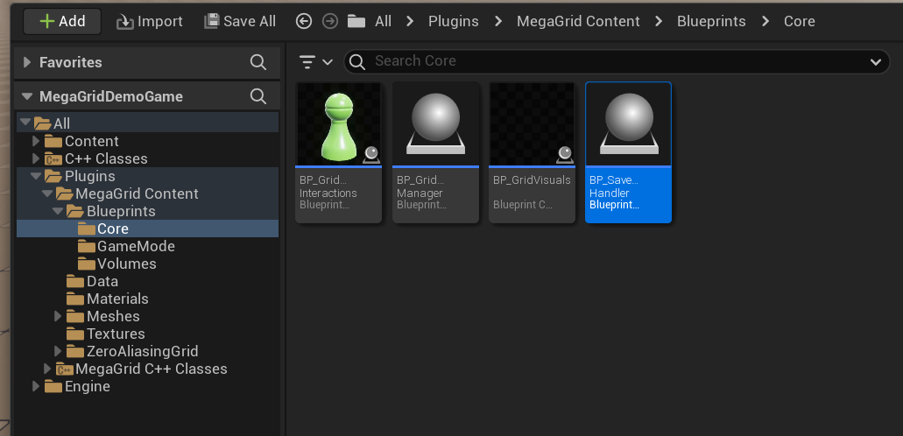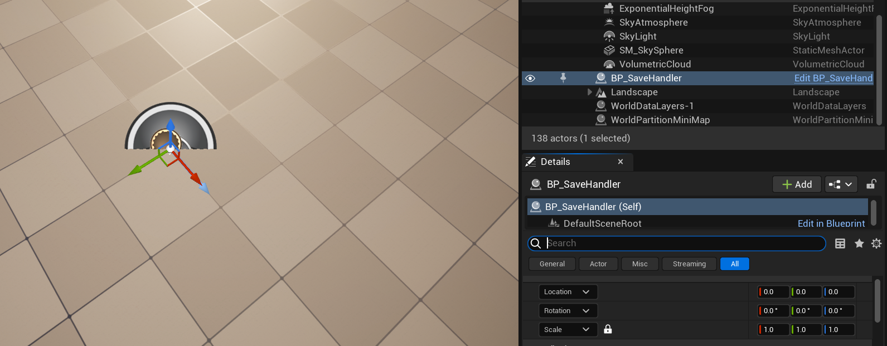

2. Once the actor has been placed, select it and search for "Save" in the details panel.

    

3. Now you'll need a ``SaveName`` to hold the grid data. Each level can have its own ``SaveName``, resulting in level based grids. Here I'm simply using the name "TutorialSave", feel free to get creative here.

    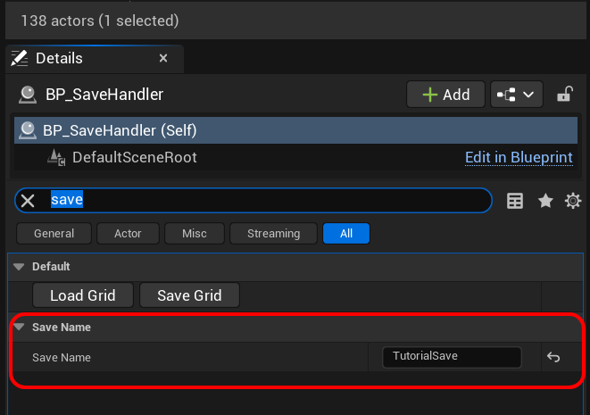

4. Next we need a default save, to do that simply press the Save Grid. And to load it, press the Load Grid. This must be done in order. 

    !!! warning
        The save and load procedure is mandatory for the grid to function.

    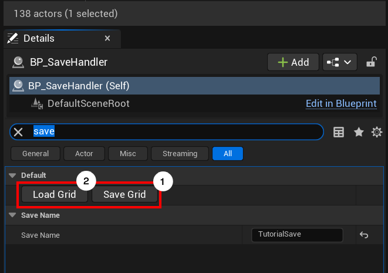

5. If you've done everything correctly, you'll see these logs.

    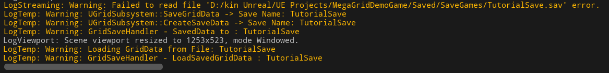

6. Next if you scroll to the **Core Dependencies** section of the SaveHandler, you'll notice empty references to GridVisuals and GridManager. These are important but we'll come back to it later, when we have all the actors placed in the scene. *[SaveHandler References](#saveHandler-references)*

    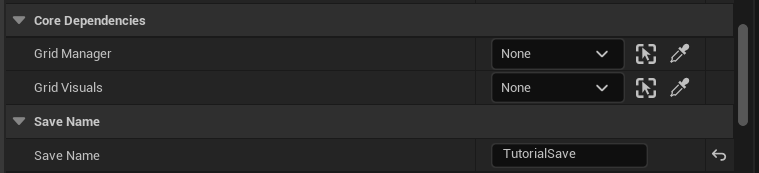

That wraps up the SaveHandler setup! Your grid is now loaded with its default settings. The newly generated .sav file can be found here: ``YourProjectFolder/Saved/SaveGames``

## 4. GridVisuals

!!! warning
    This actor is mandatory for the grid to function.

1. Now that we have an abstract grid, let's get some visuals going. Navigate to ``Plugins/MegaGridContent/Blueprints/Core/``. Find ``BP_GridVisuals`` and drag it into the level.

    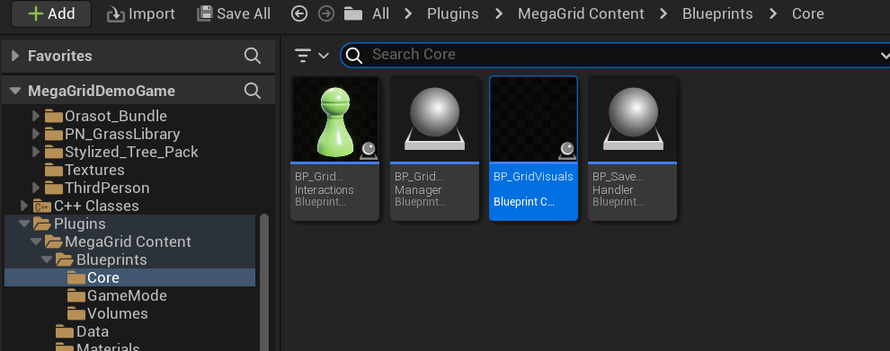

2. If you've done everything right so far, you'll see a default square grid.

    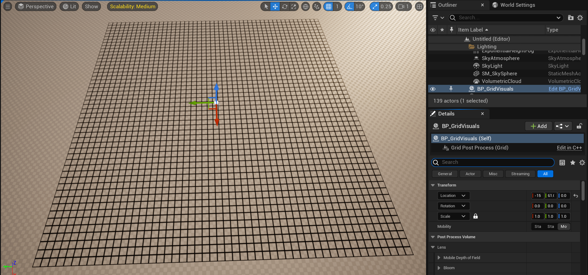

In most cases, ``BP_GridVisuals`` isn’t meant for direct interaction. Its visuals are managed by other classes like GridManager and TileEditorMode. For advanced customizations, you may need to explore the various options available in this blueprint, which are covered in detail in its own section. For now, simply leave ``BP_GridVisuals`` as it is.    

!!!note
    If you don't see the grid, it might be because you haven't set the custom depth settings properly or you might've not properly created the save. Try the previous steps again and if you still cannot figure it out, feel free to reach out.

## 5. GridManager

!!! warning
    This actor is mandatory for the grid to function.

With both the save system and visuals set up, we can now move on customizing the grid using ``BP_GridManager``. This actor serves as the bridge between data and visuals, allowing access to key grid functions. Through this class, you can manage tile data, grid data, and other essential settings.

1. Navigate to ``Plugins/MegaGridContent/Blueprints/Core/`` Select BP_GridManager and drag it into the level.

    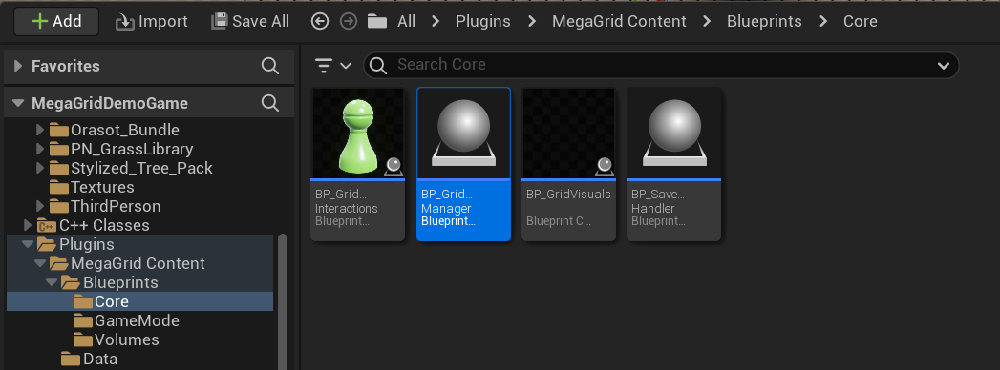

2. Now go to the details panel, and search for *"GridVisuals"* and set the reference to the existing ``BP_GridVisuals``. This will immediately shrink your grid to match the settings present in ``BP_GridManager``.

    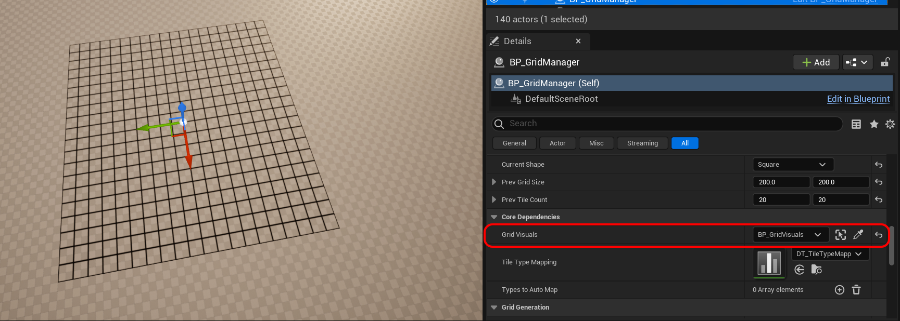

3. Next, we need to assign the trace channels we created. Navigate back to the **Default** section, where you'll find two exposed trace variables: ``GridSurfaceChannel`` and ``AutoMapChannel``. If you followed the recommended creation order, they should already be assigned correctly. If not, simply select the appropriate channels manually. 

    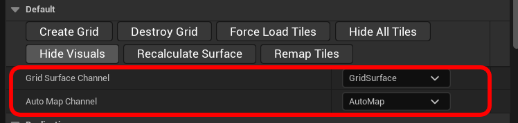

4. With that done, you can now start customizing the looks of your grid. Including switching its shape to hex!

    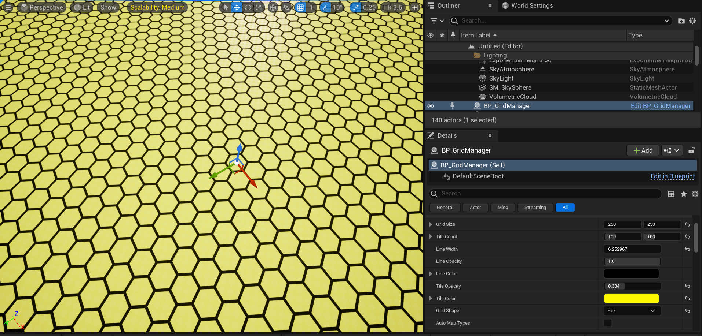

## 5.1. SaveHandler References {#saveHandler-references}

Before we get into creating the tiles, let's go back to the ``BP_SaveHandler`` and assign those references.

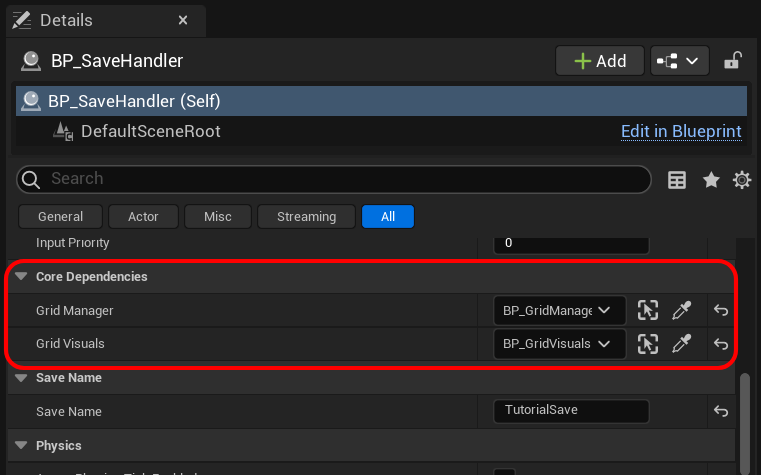

These references are essential for executing specific functions, such as synchronizing ``BP_GridManager``'s exposed variables with the loaded save and loading the appropriate visuals in ``BP_GridVisuals``. Each time you open a level, the save handler takes care of loading the grid, including both the data and visuals.

## 6. Creating the Grid

Now, it's time to create the grid, which involves generating the actual tiles. As we create the tiles, the data side of the grid will also be populated with tile information, essential for any interactions. At this point, the grid only has material-based visuals, but these offer a good preview of how the data side will be structured. Be sure to set your preferred ``TileCount`` and ``GridSize`` before proceeding.

Once you're set, come to the default section of the ``BP_GridManager`` and click the CreateGrid button. This will generate all the tiles in your grid.

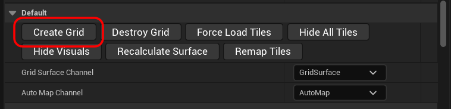

!!! note 
    Depending on the ``TileCount``, the creation process may take some time. Allow up to 30 seconds for larger grids.

If you don't see anything, don't worry just yet. By default, all tiles are set to the "Default" type, meaning their colors will be transparent. To confirm that the tiles have been created, select the ``BP_GridVisuals`` and check the outline of the tile instances.

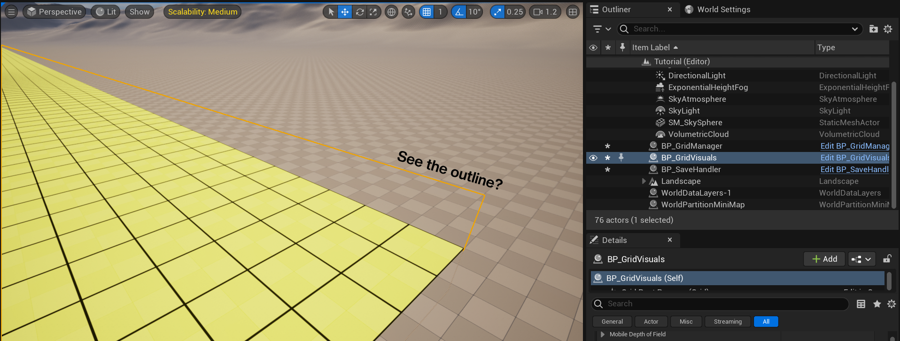

!!! bug 
    
    Severity: Negligible
    
    If you find that the bounds are outside the grid, it's because the default TileCount hasn't been updated after assigning the ``GridVisuals``. The data still assumes there are 100x100 tiles, while the visuals only expect 20x20 tiles. To resolve this, simply adjust the ``TileCount``, and everything should align correctly.

If you can see it, then congratulations! You've created your very first grid. If you cannot, there are three areas to check. 
    
- Whether you've properly assigned the trace channels in ``BP_GridManager``. 
- Whether your surface is properly blocking the ``GridSurface`` channel. 
- Whether you have assigned the *"GridSurface"* actor tag to your surface.

### Verifying Interactions

You can verify if the tiles have been properly generated by pressing play and checking if the tile under the cursor highlights. (Ignore the red tiles, we'll get into that in the next section.)

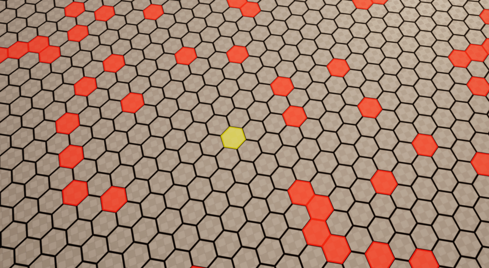

The highlighting is managed by a built-in ``BP_GridManager`` function that runs every 0.03 seconds. For high-frequency calls, I recommend using ``Timer by Event()`` or ``Timer by Function Name()`` instead of relying on ``Tick()``, which should be avoided whenever possible.

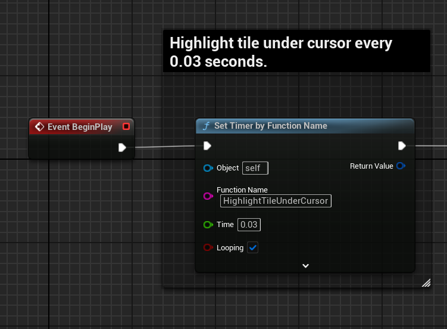

## 7. Basics Completed! {#random-obstacles-generation}

If you've been able to create an interactive grid, then congratulations! You have now completed the basics! In the next sections we'll cover slightly more advanced topics. Till then you can play around with generating random obstacles by checking the ``Random Obstacles`` boolean in ``BP_GridManager``, and then hitting CreateGrid again.

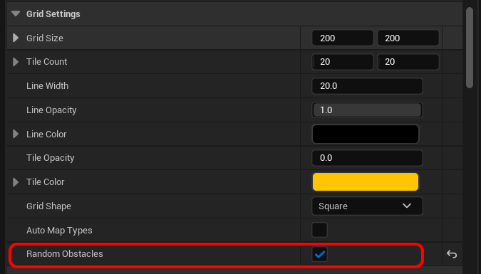

You can adjust the obstacle spawn rate via ``Obstacle Spawn Rate``.

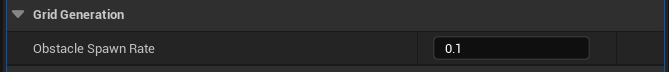

Feel free to play around with other settings as well! If you're in the mood to close your project and return later, be sure to manually save the grid by hitting **CTRL + S** and going to the ``BP_SaveHandler`` and hitting the Save Grid button. Currently the plugin doesn't support auto-saves. *(Which will be covered in its own section).*

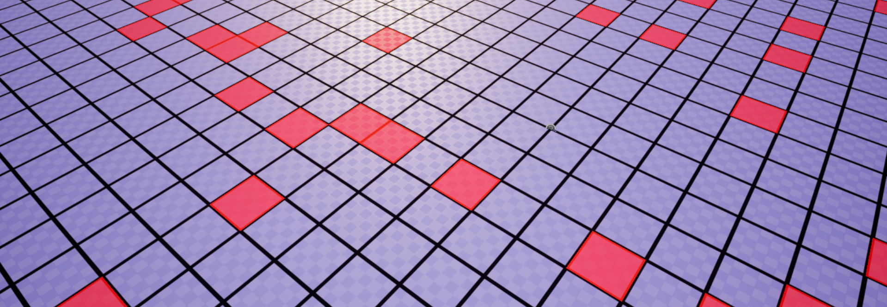