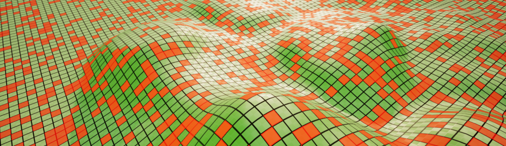

# Multi-Level Grids

## Setup

In this section, we'll cover how to create distinct grids for each level. Essentially, since grid data is saved and loaded from a .sav file, you can assign a unique .sav file to each level. This is managed through ``BP_SaveHandler`` using the ``SaveName``.

To set up a grid in a new level, simply follow the steps beginning with [Step 2](introduction.md#level-grid-creation) in the **Setting Up** section. The only adjustment you'll need to make is specifying a unique ``SaveName`` in [Step 3](introduction.md#assign-save-name) within the ``BP_SaveHandler``.

This will allow you to have level-specific grids! You can modify the shape, tile count, generate tiles, and more—each change will only be applied to the current level.

## Saving

Always save your current level's grid data using the Save Grid button in ``BP_SaveHandler`` before switching to a new level. While runtime level changes are automatically handled by the plugin, PIE (Play In Editor) changes require manual handling. For instructions on managing PIE level changes, refer to [Saving Multi-Level Grids](saving-basics.md#saving-multi-level-grids). Additionally, remember to press ``CTRL + S`` to save actor settings before changing the level in the editor.

