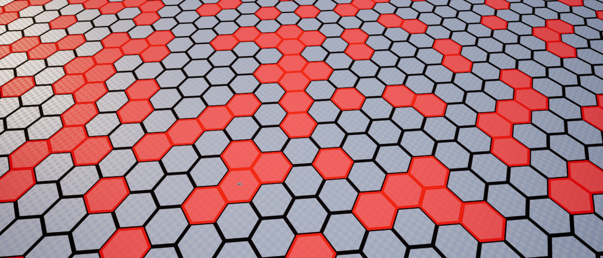
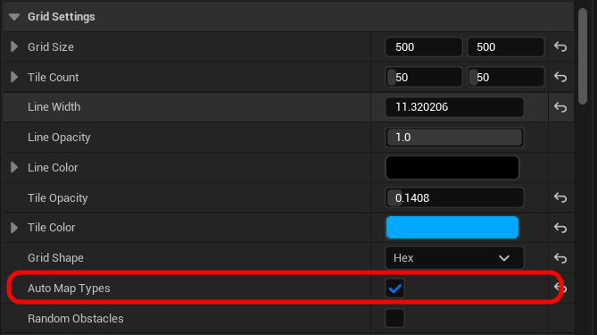
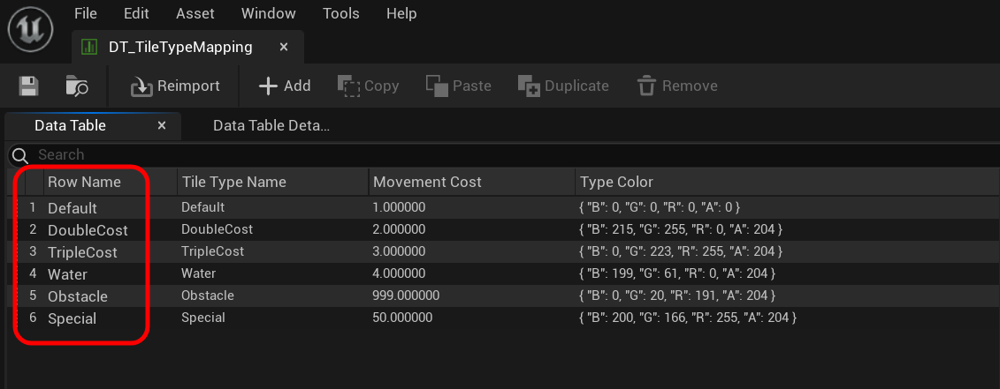
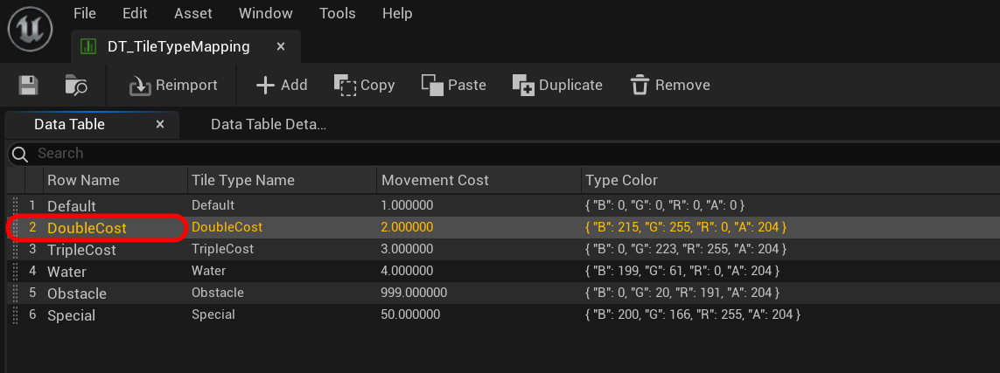
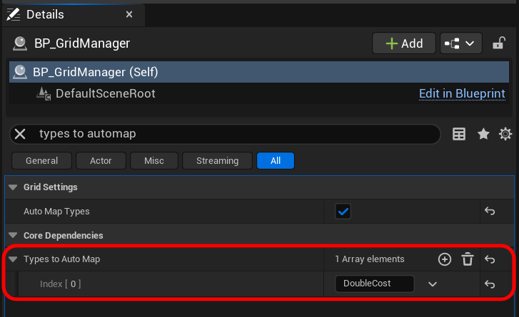
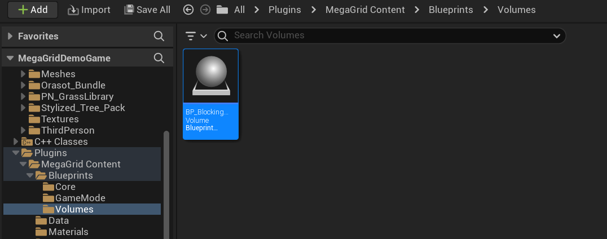
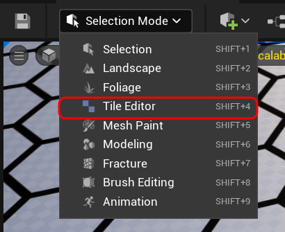
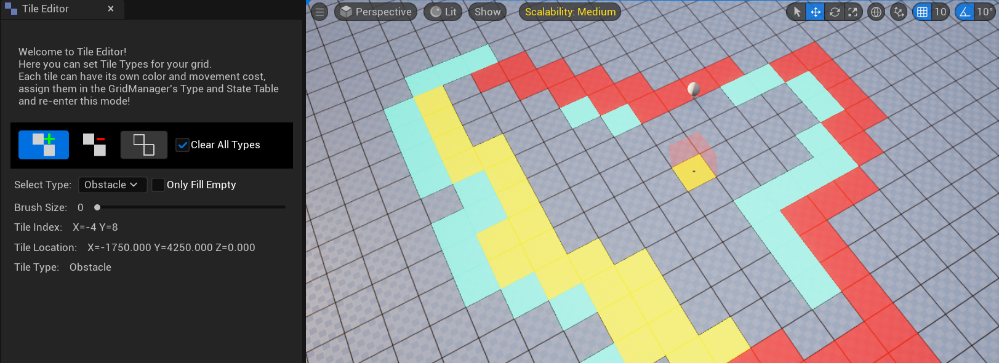

## Introduction

Now that we have a basic (mostly empty) grid, it's time to start populating it. In this context, populating means creating tiles and assigning them types either through random probability or by auto-mapping them based on specific criteria. This section will be divided into three sub-sections:

- **Generating Random Obstacles.**
- **Auto-Mapping Types.**
- **Using the Tile Editor.**

!!! note
    Without tiles, the grid is purely visual and cannot be interacted with.

## 1. Generating Random Obstacles

If you've been following this guide step by step, you should already know how to do this. If not, refer to the section [here](introduction.md#random-obstacles-generation). This is the easiest method for assigning types to your tiles, making it ideal for quickly verifying if your grid is functioning correctly and testing pathfinding.

!!!note
    Random obstacle generation only assigns the Obstacle type, while the rest of the tiles are set to Default.

    

## 2. Auto-Mapping Types (Recommended)

While randomly generating obstacles can be exciting, it lacks predictability and may not always be ideal. When precise control over tile types is needed while still allowing some level of automation, the auto-map function is ideal. I recommend this approach for most users.

### Setup

There are two methods for auto-mapping types. The first involves adding specific actor tags to the actors in the scene, which is great if you already have a level populated with actors (like buildings, decorations, or units) and want to quickly map the types with minimal effort. The second method uses **Blocking Volumes** placed in the scene, which requires a bit more work upfront but is more efficient during grid generation. Both methods are reliable for type assignments, so the choice depends on your personal preference.

For both methods to work you need to enable ``Auto Map Types`` in the **Grid Settings** section of the ``BP_GridManager``. If ``Random Obstacles`` is checked, uncheck it.

Both methods will also use **Type Tags**. This refers to row names of the types specified in the type mapping data table located in ``Plugins/MegaGrid Content/Data/``.

### 1. Mapping Using Existing Actors.

In cases where you already have actors placed in your scene, the procedure is quite simple. However do note that auto-mapping is a static procedure, in that it doesn't dynamically update the tiles associated with the actors after initial mapping. Think of this as simply using the actors as a guide to tell what types the tiles are. If the actors had to move later, the function must be called again or the types updated manually. For this example, I'll be using a default sphere placed at 0, 0, 0.

#### Steps {#regular-actor-automap-routine}

1. Select your actor/s, in the details panel search for *"Collision"*. Set the ``Collision Presets`` to ``Custom`` and set the **AutoMap** channel's response to **Block**.

    

2. Next search for *"Tags"* and in the **Actor** section, create a new tag with the row name of the type you want to map. In this case I'm going to use "DoubleCost" as seen in the default TileTypeMapping table.
    
    !!! note
        Each tile can only have one type.

    

    

3. Lastly we need to tell the GridManager what types to auto map. So go to ``BP_GridManager``, search for *"Types To AutoMap"* and add the row names of the types you want to map. If you're using multiple types, add them all here. In this case, I'm only using DoubleCost.

    

Once all that is done, you can hit the CreateGrid button in ``BP_GridManager`` and you'll see your tiles being automatically mapped to their specified types.

In this example I've only used one actor with one type. But you can use multiple actors each with their own unique types, something like this.

#### Shape Trace

In the picture above you can see the auto-mapping function missed certain tree tiles. This happens because by default line trace is used to check for actors. So for complex meshes like a tree, the line trace sometimes misses its mark. But don't worry we can toggle ``Use Shape Trace`` in ``BP_GridManager`` and this will usually solve the issue.

Keep in mind that shape traces are usually more expensive but it makes up for it with accuracy. If you're still unhappy with your shape trace's accuracy, you can tweak the ``Auto Map Extent`` in ``BP_GridManager`` for finer control. 

As you can see higher values catch even the smallest bleeds into neighboring tiles. 

### 2. Mapping Using Blocking Volumes

The second auto-mapping method closely resembles the first, but instead of using custom actors, it utilizes **Blocking Volumes** from MegaGrid. While this approach requires more initial setup, it offers a slight edge in grid generation. 
The key benefit lies in the shape of the volumes—since they perfectly align with the tiles, ``Use Shape Trace`` becomes unnecessary. Even without it, this method remains the most precise of the two.

#### Performance Considerations

For larger grids, I wouldn't recommend this method. The first problem is the time it takes to manually place blocking volumes. The second issue arises when the editor starts to slow down due to having a large number of volumes in the scene.

#### Steps

1. Navigate to ``Plugins/MegaGridContent/Blueprints/Volumes/``, select ``BP_BlockingVolume`` and drag it into the level.

    

2. By default, the volume will be a cube. If you're using a hex grid, you can enable the ``Is Hex`` boolen in the **Default** section. Additionally, adjust the transform so that it aligns with the tile.

    

3. Once you've placed your **Blocking Volume**, the next steps are the same as using a regular actor. [Follow these steps.](#regular-actor-automap-routine). 
    
    - Set ``Collision Presets`` to ``Custom``. *(Here make sure you've selected the mesh component)*.
    - Set ``Collision Response`` for **AutoMap** to ``Block``.
    - Add the row name of the type in the Actor Tags. *(Here make sure you've selected the actor)*.
    - Add the same type name in the ``BP_GridManager``'s ``Types To Auto Map``.

4. Finally, you can press CreateGrid in ``BP_GridManager`` to map the tiles. The advantage of auto-mapping is that both methods can be used simultaneously—for precise control, you can utilize **Blocking Volumes**, while the first method is ideal for covering larger areas efficiently.

    

### Why I recommend this?

This grid generation method operates independently of .sav files. Even if a save file is missing or corrupted, the grid remains unchanged since it is generated on demand and remains consistent after the initial actor placements. As a result, you won’t need to include a default .sav file with 
your packaged game—the grid is created automatically when the game runs for the first time. See packaging section for more.

## 3. Using the Tile Editor

Next, we'll explore manually setting types using the **Tile Editor**. This approach provides the most control and comes with several helpful features to speed up your development. However, I recommend using this method primarily for smaller grids. For larger grids, it's best to combine different methods.

### Understanding the Tile Editor

The **Tile Editor** is a custom editor mode that can be accessed by expanding the editor modes dropdown at the top of the project. 

The **Tile Editor** needs a ``GridManager`` class to be present in the level to function properly. However, you can still enter the mode without one—you just won't be able to interact with the grid. This mode lets users manually assign or remove tile types. It also includes several useful features to streamline the process, so let's go over what each button does.

    

1. **Add Type**

    When this button is enabled, clicking anywhere on the grid will change the clicked tile's type to the ``Selected Type``. If the ``Fill Only Empty`` option is checked, only empty tiles (Default) can be modified. If unchecked, any tile can be changed.
    
    { width=278 height=444 }

2. **Remove Type**

    When this button is enabled, clicking anywhere on the grid will changed the clicked tile's type to Default. If the ``Clear All Types`` option is checked, any tile can be removed. If unchecked only the selected type can be removed.

3. **Clear Types**

    If ``Clear All Types`` is checked, all tiles in the grid will be reset to Default. If unchecked, only the tiles of selected type are reset.

    3.1 **Clear All Types**

    Flag to tell if all types will be affected or just the selected type.

4. **Select Type**

    Dropdown to select the type to paint with. If you add or remove types in the data table, you must exit and re-enter the **Tile Editor** for it update. Any removed types will be reset to Default.

5. **Fill Only Empty**

    Flag to tell whether to affect only empty tiles (Default). Useful for complex painting.

6. **Brush Size**

    Radius of the brush size. Min = 1 | Max = 8 (Can be changed in source).

### Painting Types

Using these tools you can "paint" types on your grid. It's pretty simple, just click the ``Add Type`` button, select the type you want to assign and start painting. You'll see a spherical gizmo confirming your clicks. You can play around with various brush sizes as well.   

Of course everything also works with square grids.

!!!bug
    Severity: Negligible

    Sometimes simply clicking on a tile won't affect it, you might've to move it just a wee little bit.