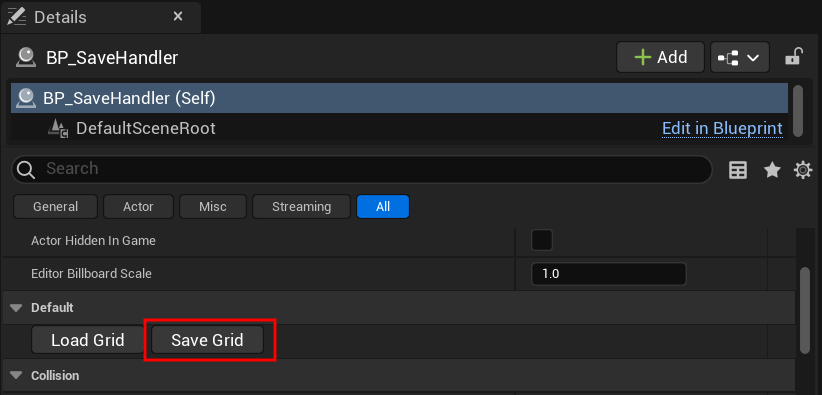

# Basics about Saving Your Grid.

So we have a grid populated with tiles. What now? In this section we'll go over some of the best practices for saving your grid related data. It is absolutely **essential** that you follow these procedures to ensure the integrity of your data.

!!! warning
    The plugin currently **doesn't support auto-saving or runtime saves**, so you have to manually save the grid data everytime you make changes and    implement your own runtime save system.

## Editor Saves

Anytime you make changes to the grid. Go to ``BP_SaveHandler`` and hit the <span class="highlight-box-settings">Save Grid</span> button.
It is essential that you do this as much as possible, since there are no auto-saves, you may risk losing your progress.



!!! tip
    If you find it tedious to go to ``BP_SaveHandler`` everytime you make changes, I suggest you look in the direction
    of ``Editor Widgets`` and make a system that auto-saves every now and then. 

## Runtime Saves

By default, the plugin does not support runtime saving. This decision was intentional, as I wanted to separate editor data from runtime data. 
I realized that saving both types of data into the same plugin-specific .sav file might not be ideal for most cases. By keeping ``EditorState`` and ``RuntimeState``
separate, you gain more control during development. Instead of mixing all the data, you have a clear distinction between development data and gameplay data. 
For example, if you're testing how auto-mapping works and set up a detailed grid, you can hit play and experiment with custom implementations, 
such as modifying grid-related data. If anything goes wrong, you can easily revert to the editor state once you stop the play session. This separation 
ensures that you can focus on your development work without the concern of accidentally messing up core data.

However, for those wishing to take advantage of the existing MegaGrid save system, you'll need to make some modifications to the source code. Which is what we'll be covering now.

### Steps

1. First open up your code editor and navigate to ``GridSubsystem.cpp``, you can find it here:

    

    If cannot find the ``Plugins`` folder, you may have to **Generate Project Files** by right-clicking your .uproject in file explorer.

2. The changes we're concerned with are in ``UGridSubsystem::SaveGridData(FString SaveName)``:
    
    ```cpp

     // GridSubsystem.cpp

    void UGridSubsystem::SaveGridData(FString SaveName)
    {
    	// Saves all the subsystem variables to the given save game

    	UGridPluginSave* PluginSaveInstance = Cast<UGridPluginSave>(UGameplayStatics::LoadGameFromSlot(SaveName, 0));

    	UE_LOG(LogTemp, Warning, TEXT("UGridSubsystem::SaveGridData -> Save Name: %s"), *SaveName);

    	// Check if the save file already exists, if yes then proceed to save.
    	if (PluginSaveInstance)
    	{
    		PluginSaveInstance->SavedGridData = EditorState.GridData;
    		PluginSaveInstance->GridSize = GridSize;
    		PluginSaveInstance->LastGridSize = LastGridSize;
    		PluginSaveInstance->GridOffset = GridOffset;
    		PluginSaveInstance->bIsHex = bIsHex;
    		PluginSaveInstance->TileCount = TileCount;
    		PluginSaveInstance->StartIndex = StartIndex;
    		PluginSaveInstance->EndIndex = EndIndex;

    		PluginSaveInstance->LineWidth = LineWidth;
    		PluginSaveInstance->LineColor = LineColor;
    		PluginSaveInstance->LineOpacity = LineOpacity;
    		PluginSaveInstance->TileOpacity = TileOpacity;
    		PluginSaveInstance->TileColor = TileColor;

    		UGameplayStatics::SaveGameToSlot(PluginSaveInstance, SaveName, 0);
    	}

    	// Else, create a new one with default values.
    	else
    	{			
    		CreateSaveData(SaveName);
    	}

    }
    ```

    ``PluginSaveInstance->SavedGridData = EditorState.GridData;`` -> In this line, we're only saving to the .sav file from the EditorState.
    If we want to save from the ``RuntimeState`` as well, we can simply check if we're in runtime, if yes then save from the ``RuntimeState``.

    ```cpp

    // GridSubsystem.cpp

    void UGridSubsystem::SaveGridData(FString SaveName)
    {
    	// Saves all the subsystem variables to the given save game

    	UGridPluginSave* PluginSaveInstance = Cast<UGridPluginSave>(UGameplayStatics::LoadGameFromSlot(SaveName, 0));

    	UE_LOG(LogTemp, Warning, TEXT("UGridSubsystem::SaveGridData -> Save Name: %s"), *SaveName);

    	// Check if the save file already exists, if yes then proceed to save.
    	if (PluginSaveInstance)
    	{
    		PluginSaveInstance->SavedGridData = bIsRuntime ? RuntimeState.GridData : EditorState.GridData;
    		PluginSaveInstance->GridSize = GridSize;
    		PluginSaveInstance->LastGridSize = LastGridSize;
    		PluginSaveInstance->GridOffset = GridOffset;
    		PluginSaveInstance->bIsHex = bIsHex;
    		PluginSaveInstance->TileCount = TileCount;
    		PluginSaveInstance->StartIndex = StartIndex;
    		PluginSaveInstance->EndIndex = EndIndex;

    		PluginSaveInstance->LineWidth = LineWidth;
    		PluginSaveInstance->LineColor = LineColor;
    		PluginSaveInstance->LineOpacity = LineOpacity;
    		PluginSaveInstance->TileOpacity = TileOpacity;
    		PluginSaveInstance->TileColor = TileColor;

    		UGameplayStatics::SaveGameToSlot(PluginSaveInstance, SaveName, 0);
    	}

    	// Else, create a new one with default values.
    	else
    	{			
    		CreateSaveData(SaveName);
    	}

    }
    ```
    With this change, the plugin can save in runtime as well! 


3. To save in runtime, you can use a similar setup as you see below. I've made it so that pressing ``CTRL + S`` in-game will save any changes made. Do keep in mind that these changes are ultimately saved to file (.sav). So they will be reflected in the editor as well. If you don't see the changes after you stop PIE, you simply have to press the <span class="highlight-box-settings">Load Grid</span> button via ``BP_SaveHandler``this will refresh the visuals.

    

!!! note
    If you're using this system make sure you keep MegaGrid data isolated from the rest of your game.

## Multi-Level Grids

As mentioned earlier, MegaGrid also supports multi-level grids. This means each level can read from its own .sav file. However there are strict procedures concerning the save system. In the editor you must **manually save** the current level's grid before you open another level. You can do so by pressing the <span class="highlight-box-settings">Load Grid</span> button via ``BP_SaveHandler``. The loading however is done automatically. 

Runtime level changes are a bit more tricky and involves source code changes before packaging. 