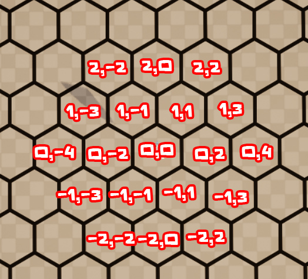

# Coordinate System

This section provides a brief overview of the coordinate system used in the plugin. Both hex and square grids use an integer-based system, represented by ``FIntPoint``. Unlike many other grid systems, MegaGrid supports **negative** coordinates.

## Square Grid

The square grid follows a **Cartesian** coordinate system (X, Y). The coordinates are determined by dividing the tile's world position by ``GridSize``.

## Hex Grid 

The hex grid is more complex. In most cases, including tile generation and ``TileData``, a **Doubled Coordinate** system is used.

However, in some pathfinding cases, **Doubled Coordinates** are converted to **Axial Coordinates** for improved performance and accuracy. Hexagonal coordinates can be easily converted between different formats using functions in ``GridUtils``. You can use these conversions as needed, but always revert to **Doubled Coordinates** when setting values in ``TileData`` or ``GridData``.

