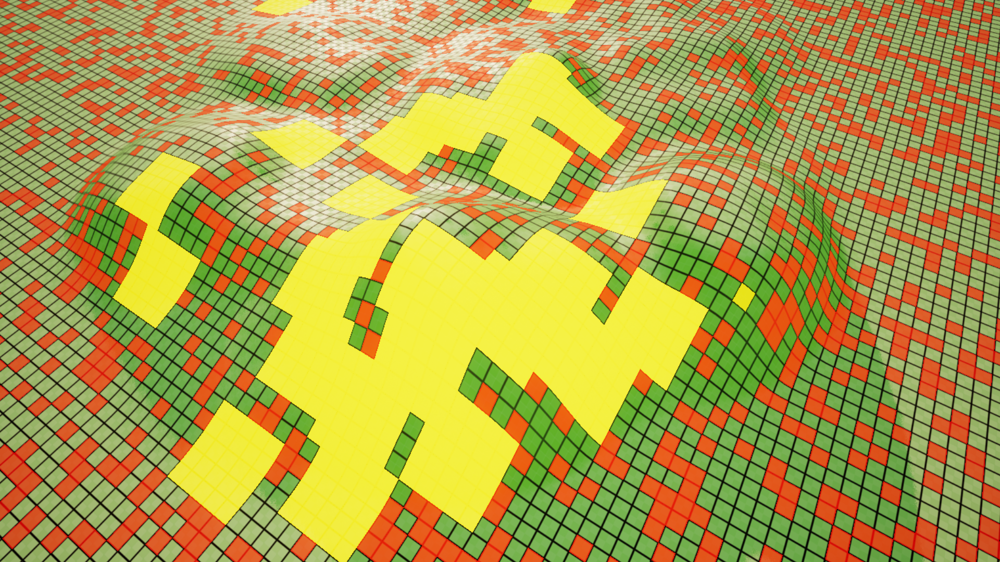

# Grid Interactions

In this section, we’ll explore how you can interact with your grid. While there are various ways, everything essentially boils down to a few key interactions:

1. Get / Set Tile Data
2. Get / Set Tile States
3. Get / Set Tile Type
4. Get / Set Grid Data
5. Pathfinding

You’ll notice that nearly all of the above involve accessing and modifying something called **"Grid Data."** This is a broad term encompassing any data related to your grid, including tile types, tile states, line properties, movement costs, and more.
 When we talk about interactions like *highlighting tiles* or *selecting tiles*, these are directly related to ``Tile Data``, as they involve modifying individual tile information.

I won’t dive into the specifics of data here, as you can reference the code documentation for that. In the upcoming sections, we’ll focus on how to implement and use Blueprint functions to interact with the grid, taking a high-level approach to these tasks.

