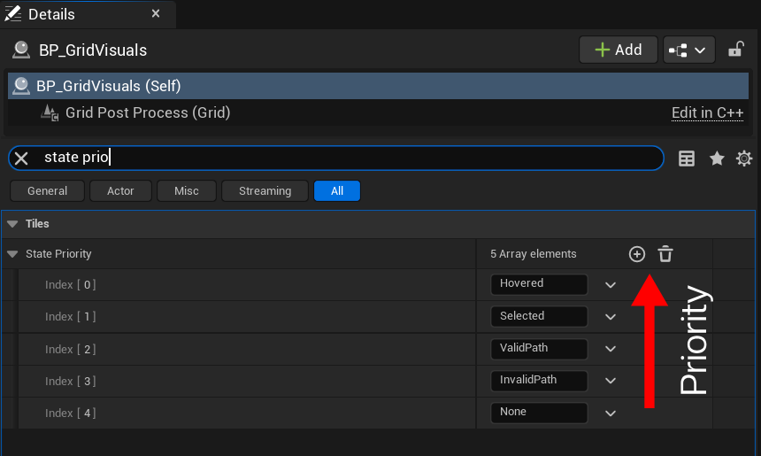

# Tile States

## Introduction

``TileState`` is similar to ``TileType`` but the key difference is that it isn't meant to affect pathfinding. Each tile can also
have several tile states, however a single state is picked based on priority. States are meant to be temporary visual representations
of a tile's behavior, e.g path, hover, selection, etc. ``TileState`` also takes priority over ``TileType``, if the state's color alpha is 
less than 1, color mixing is used to fake transperency. 

## Adding Custom States

1. To add a new state, simply navigate to ``Plugins/MegaGridContent/Data/`` and open the ``DT_TileStateMapping``.
    
    

2. Here press the Add button to create a new row.

    

3. Modify the row values as needed. Ensure that the **Row Name** and **Tile State Name** are identical.

    

## Deleting States 

Deleting states follows the same process as adding them—simply delete the corresponding row in the data table. **DO NOT** delete core states.

## Getting Tile States

You can retrieve a tile's states using the ``GetTileData()`` function. This function returns a ``TileData`` struct, which can be broken down to access the ``TileStates``. Called via ``BP_GridManager``.

## Adding Tile States

Unlike tile types, you can keep adding states to a tile. You can do so using ``AddStateToTile()``, which requires the following parameters: 

- ``TileIndex``: The index of the tile to modify.
- ``State``: The desired tile state.
- ``Context``: Defines whether the operation is for Editor or Runtime (best set to Auto).
- ``bReloadTile``: Determines whether to refresh the tile's visuals immediately after modification.
- `ScopeLock`: This determines whether to lock the data being accessed, ensuring that no other operations interfere with the data during its usage. 

Called via ``BP_GridManager``.

## Removing Tile States

To remove a state from a tile, you can use the ``RemoveStateFromTile()`` function. This function takes similar arguments to ``AddStatetoTile()``. Called via ``BP_GridManager``.

## Reloading Tiles

[Refer here.](tile-types.md#reloading-tiles)

## Core States

MegaGrid includes several default tile states in the ``DT_TileStateMapping`` data table. It’s crucial that you **DO NOT** modify these states, as they are essential for the proper functioning of the grid. If you create your own data table, ensure these default states are still included.

Core States:

- **Default**
- **Hovered**
- **ValidPath**
- **InvalidPath**

## Custom Tables 

You can create and use your own custom data tables if you prefer. Just make sure to include the core states in your table as well. Once you’ve created your custom table, you’ll need to assign it to ``BP_GridVisuals``.

## State Priority

Since a tile can have multiple states, the `State Priority` array determines which state takes precedence in rendering. To adjust the order of priority, navigate to `BP_GridVisuals` and look for *"State Priority"*. The priority follows ascending order, meaning states with lower indices take higher precedence. The states are chosen dynamically, so when a state is added or removed, the visuals will automatically update. Make sure to add your custom states (if any) to this list, or they won't be rendered.

## Toggling State Visibility

You can control the visibility of states using the `SetStateVisibility()` function. This will hide all tiles of the specified state, but the state will remain in the data; only the visuals will be toggled. Called via ``BP_GridManager``.

## Scope Lock

`ScopeLock` serves as a safeguard against race conditions, particularly in scenarios where MegaGrid's async functionality may lead to simultaneous data access conflicts.  

For example, if both tile selection (under the cursor) and async pathfinding are running at the same time, they might attempt to access the same `TileState` data concurrently, potentially causing a crash.  

To mitigate this, `bScopeLock` was introduced. While it’s not always necessary, enabling it in situations involving concurrent data access can help ensure stability. In my testing, even with over 4 million async calls, I didn’t encounter any issues. However, race conditions can be unpredictable—if you suspect a crash related to one, please report it immediately.

### Best Practices

Race conditions are inherently unpredictable, making crashes difficult to debug. While I’ve extensively tested this plugin before release, system-specific variables may still lead to unexpected issues. To minimize the risk of race conditions, consider the following best practices:

- **Prefer Synchronous Execution When Possible**  
  While async pathfinding is supported, try to use synchronous execution whenever feasible. Reserve async pathfinding for situations where it’s absolutely necessary.

- **Limit Async Frequency**  
  For large grids, async pathfinding is often essential (which is why I implemented it), but frequent calls can increase the risk of conflicts. If possible, use static async pathfinding (one-time calculations) rather than continuous real-time updates.

- **Use ScopeLock When Needed**  
  `ScopeLock` helps prevent multiple systems from accessing the same data simultaneously. While I’ve implemented it in key areas, I’ve also provided the flexibility to disable it in certain functions for modularity. Enable it whenever you're dealing with concurrent data access to ensure stability.