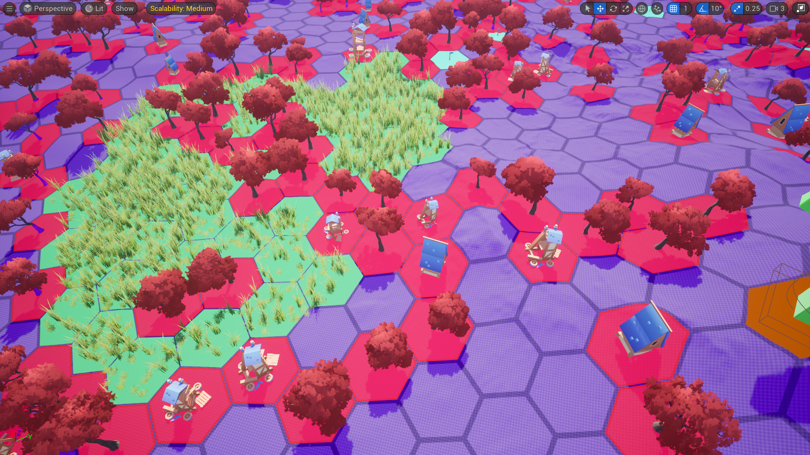

# **Welcome to MegaGrid Docs!**

MegaGrid is a powerful and flexible C++ plugin for Unreal Engine 5, designed to handle grid-based mechanics with precision and efficiency. Whether you're developing a turn-based strategy game, RTS, or an Open-World, MegaGrid provides an optimized solution for managing grids on both flat surfaces and complex landscapes.

## General Features

| Feature                      | Description                                      |
|------------------------------|--------------------------------------------------|
| ✅ **Zero Aliasing Grid**     | Procedural grid with high customizability and little aliasing artifacts |
| 🔷 **Hex & Square Support**   | Supports both hexagonal and square grids |
| 🎨 **Customizability**        | Customize the looks of your grid to your heart's content |
| ⛰️ **Surface Adaptation**     | Can generate grids on any surface |
| 🏗️ **Modular Design**         | Easily integrates with other systems |
| 🛠️ **Tile Editor Mode**       | For easy editor workflows |
| 📏 **Grid Utilities**         | Tons of standard grid utilities |
| 🏢 **Multi-Level Support**    | Create unique grids for every level |
| 🎭 **Tile Types & States**    | For limitless interactions |
| 🌍 **Huge Grids**             | Supports up to **300x300** tiles |
| 🚀 **Highly Optimized**       | Plugin has been optimized and tested to its limits |
| 📘 **Vast Blueprint API**     | Easily create any system with our Blueprint API |
| 📝 **Code Docs**              | Heavily documented source code for easy expansions |

### Pathfinding Features

Quick, modular, and optimized for large grids.

| Feature                  | Description |
|--------------------------|-------------|
| 🔄 **Async Pathfinding**  | Runs in the background without freezing gameplay |
| ⚡ **Realtime Capability** | High frequency support |
| ➰ **Diagonal Pathfinding** | Supports diagonal movement for square grids |
| 🤖 **Multi-Agent Support** | Allows agent specific pathfinding |
| 🎛️ **Highly Customizable** | Easily tweak settings to fit your needs |

MegaGrid is the ultimate grid solution for developers looking to create immersive, grid-based gameplay while maintaining high performance in large, open-world environments.

## Known Issues

Tile Editor Mode has missing icons. This is due to static plugin paths, it will be fixed immediately.

## Performance Note {#performance-note}
!!! note
    Although the grid itself supports upto 90,000 tiles. The realtime pathfinding is not recommended for bigger grids. However
    low frequency async pathfinding can be used with no issues! For more information, see [pathfinding](../grid-interactions/pathfinding.md#large-scale-pathfinding).