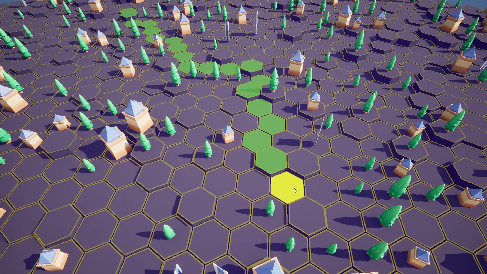

# **Modularity At Heart.**

I originally developed this plugin to add to my own game, as no existing solution offered the features I needed. So, I decided to build one myself! From the start, my goal was to make it as modular as possible, and I've remained committed to that approach.  

The grid is structured into three core classes:  

- **GridVisuals**  
- **GridSubsystem**  
- **GridManager**  

I'll be covering each of these topics in the following sections. However, if you encounter any challenges while integrating MegaGrid into your project, don't hesitate to reach out. I'm always open to making improvements to ensure a seamless development experience.